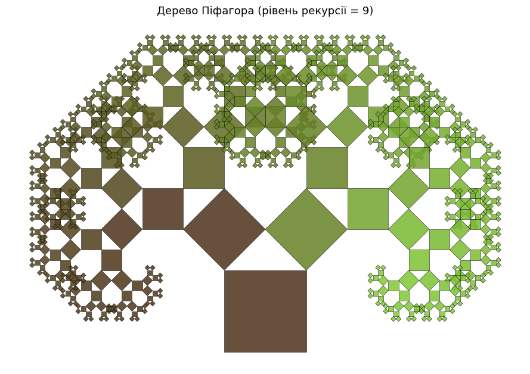
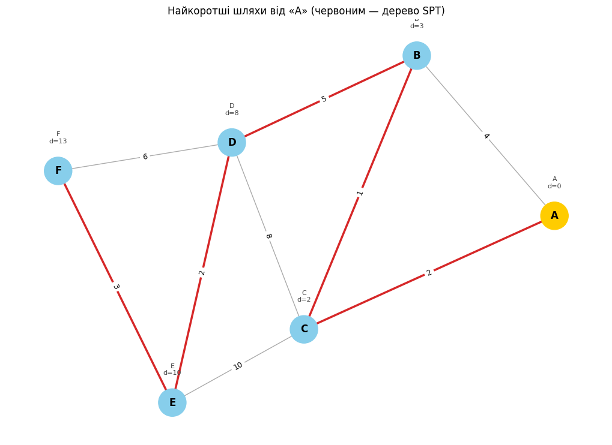
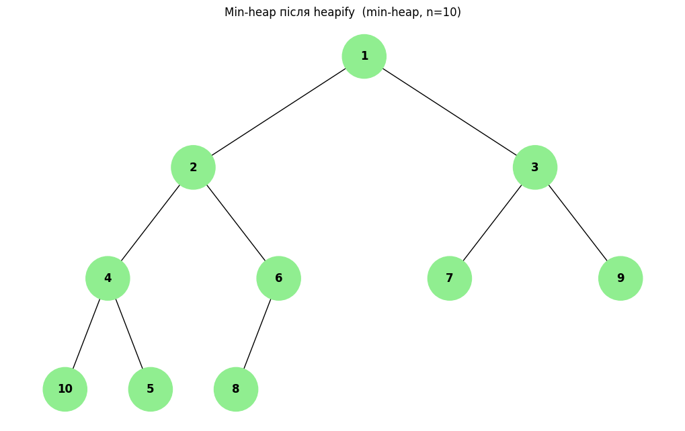
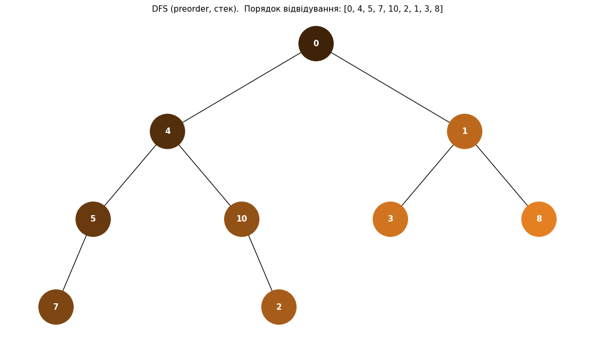
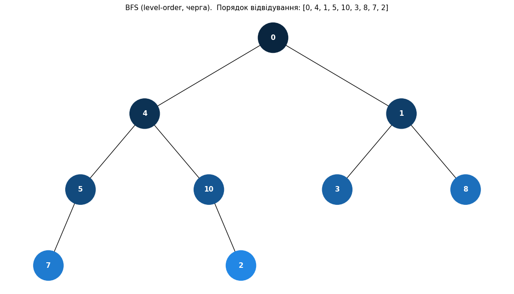
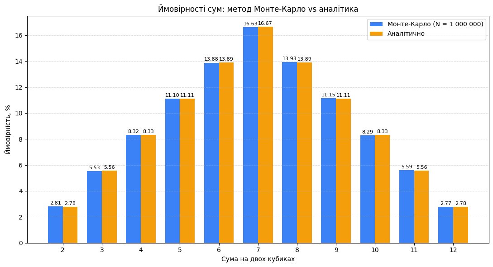

# goit-algo-fp

Фінальний проект з курсу алгоритмів та структур даних. Сім задач.

## Структура

```
task_1/  linked_list.py        реверс, сортування, merge двох списків
task_2/  pythagoras_tree.py    фрактал дерево Піфагора
task_3/  dijkstra.py           алгоритм Дейкстри на бінарній купі
task_4/  heap_visualization.py малювання бінарної купи
task_5/  tree_traversal.py     обхід дерева DFS/BFS з градієнтом кольорів
task_6/  food_optimization.py  жадібний vs DP
task_7/  monte_carlo.py        симуляція двох кубиків
```

## Запуск

```bash
python -m venv venv
source venv/bin/activate    # Windows: venv\Scripts\activate
pip install -r requirements.txt

python task_1/linked_list.py
python task_2/pythagoras_tree.py -d 9
python task_3/dijkstra.py
python task_4/heap_visualization.py
python task_5/tree_traversal.py
python task_6/food_optimization.py
python task_7/monte_carlo.py -n 100000
```

## Задача 1. Однозв'язний список

Клас `LinkedList` з трьома операціями:

* `reverse()` розвертає список на місці через три вказівники
* `sort()` сортує merge-sort'ом (ділимо навпіл через slow/fast pointer, рекурсивно сортуємо, зливаємо)
* `merge_two_sorted(a, b)` зливає два відсортованих списки в один, переплітаючи існуючі вузли

## Задача 2. Дерево Піфагора

На верхній стороні квадрата малюємо прямокутний трикутник, на його катетах два менші квадрати, рекурсія до заданої глибини. Кут при лівому катеті за замовчуванням 45°, тому дерево виходить симетричне.

```bash
python task_2/pythagoras_tree.py -d 10
python task_2/pythagoras_tree.py -d 8 --angle 30    # асиметричне
```



## Задача 3. Дейкстра

Найкоротші шляхи від однієї вершини до всіх інших. Купа через `heapq`, застарілі записи в купі пропускаємо при витягуванні (lazy deletion), щоб не возитися з decrease-key.

На вхід приймаються тільки невід'ємні ваги, інакше кидаємо `ValueError`. З від'ємними потрібен Беллман-Форд.



## Задача 4. Візуалізація купи

Беремо код з умови (`Node` + `add_edges`), на вхід приходить масив-купа, з нього будуємо дерево за формулою: нащадки індексу `i` це `2i+1` та `2i+2`. Працює для min- та max-heap.



## Задача 5. Обхід дерева

DFS і BFS без рекурсії:

* DFS через стек (`list`). Праве піддерево кладемо першим, щоб ліве оброблялося раніше.
* BFS через чергу (`deque`).

Кольори будуються в HSV: тон фіксований (синій для BFS, оранжевий для DFS), а яскравість зростає від темного для першого відвіданого вузла до світлого для останнього. Конвертується в `#RRGGBB`.

| DFS | BFS |
|-----|-----|
|  |  |

## Задача 6. Жадібний vs DP

0/1 knapsack у двох варіантах. Жадібний сортує за `calories/cost` і бере, поки вистачає бюджету. DP заповнює таблицю `dp[i][b]` і відновлює вибір зворотним проходом.

| Бюджет | Greedy | DP   | Різниця |
|--------|--------|------|---------|
| 50     | 670    | 670  | 0       |
| 75     | 670    | 770  | +100    |
| 100    | 870    | 970  | +100    |
| 150    | 1120   | 1220 | +100    |

На бюджеті 50 жадібному пощастило, далі він стабільно програє ~10%. Причина в тому, що DP готовий взяти дорожчу страву з гіршим відношенням калорій до ціни, якщо це звільняє місце під щось калорійніше пізніше. Жадібний так не вміє, він дивиться тільки на наступний крок.

## Задача 7. Метод Монте-Карло

Кидаємо два кубики, рахуємо суму, повторюємо `N` разів, потім ділимо частоту кожної суми на `N`.

```bash
python task_7/monte_carlo.py -n 1000000
```

### Результат при N = 1 000 000

| Сума | Емпірично | Аналітично | Δ (в.п.) |
|------|-----------|------------|----------|
| 2    | 2.807%    | 2.778%     | +0.029   |
| 3    | 5.534%    | 5.556%     | -0.022   |
| 4    | 8.317%    | 8.333%     | -0.017   |
| 5    | 11.100%   | 11.111%    | -0.011   |
| 6    | 13.883%   | 13.889%    | -0.005   |
| 7    | 16.630%   | 16.667%    | -0.037   |
| 8    | 13.932%   | 13.889%    | +0.043   |
| 9    | 11.147%   | 11.111%    | +0.036   |
| 10   | 8.292%    | 8.333%     | -0.042   |
| 11   | 5.586%    | 5.556%     | +0.030   |
| 12   | 2.772%    | 2.778%     | -0.005   |



### Висновки

При мільйоні кидків кожна ймовірність відхиляється від аналітичної не більше ніж на 0.05 в.п. Розподіл виходить такий же, як з підручника: пік на сумі 7, симетрія від 2 до 12.

Якщо подивитися як похибка залежить від `N`, вийде ось така картина:

| N         | Σ\|Δ\|, в.п. |
|-----------|--------------|
| 1 000     | 8.18         |
| 10 000    | 1.75         |
| 100 000   | 0.65         |
| 1 000 000 | 0.28         |

Збільшили `N` у 10 разів, похибка впала приблизно в √10 ≈ 3.16 разів. Це очікувано: стандартна похибка оцінки ймовірності пропорційна `1/√N`.

Для самих кубиків Монте-Карло насправді не потрібен. Простір подій маленький (36 рівноймовірних результатів), все обчислюється у дві дії на папері. Сенс задачі побачити, що метод дає правильну відповідь з передбачуваним темпом збіжності на прикладі, де відповідь відома.
